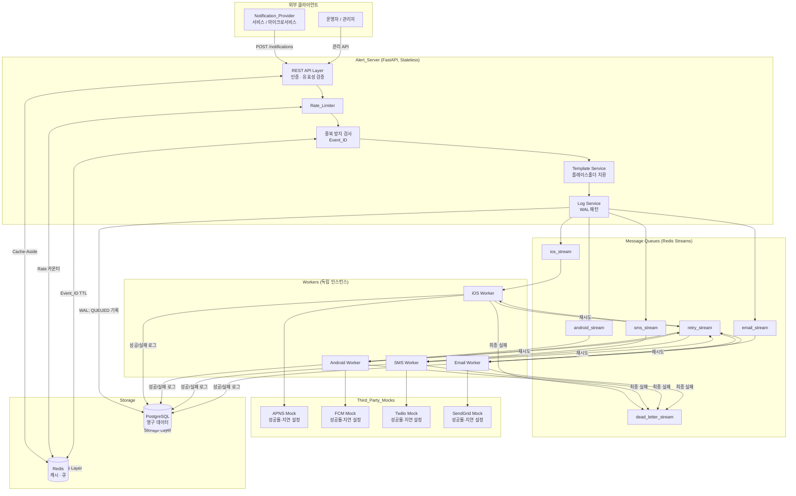
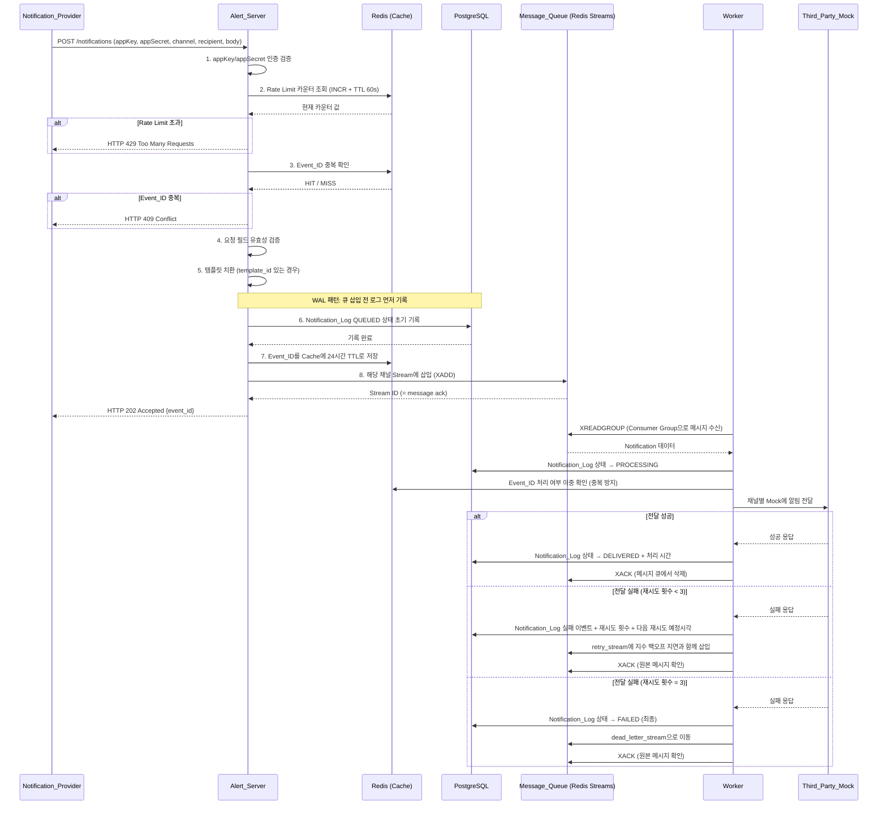
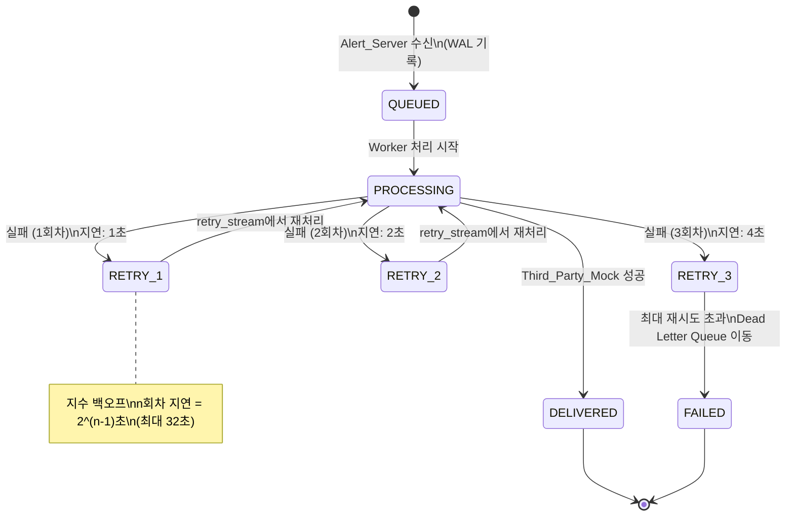

# Design Document: Alert System

## Overview

Alert System은 모바일 푸시 알림(iOS/Android), SMS, 이메일 세 가지 채널을 지원하는 분산 알림 플랫폼입니다.
실제 서비스(APNS, FCM, Twilio, SendGrid) 대신 Mock 구현을 사용하여 핵심 아키텍처 패턴을 학습하고 검증하는 토이 프로젝트입니다.

### 목표

- 채널별 독립 메시지 큐를 통한 느슨한 결합 구조 구현
- 지수 백오프 재시도 + Dead Letter Queue로 알림 유실 방지
- Event_ID 기반 중복 방지 (Cache + Notification_Log 이중 검사)
- Rate Limiting (사용자별 채널당 분당 60회)
- Write-Ahead Logging 패턴으로 데이터 무결성 보장
- Stateless Alert_Server로 수평 확장 가능한 구조

### 기술 스택 선택

| 컴포넌트 | 선택 | 선택 이유 |
|---------|------|----------|
| API 서버 | **Python + FastAPI** | 개발 편의성, async 지원, 자동 OpenAPI 문서, 학습 목적에 적합 |
| 메시지 큐 | **Redis Streams** | 캐시(Redis)와 인프라 공유, Consumer Groups으로 At-Least-Once 보장, Dead Letter 패턴 지원, 토이 프로젝트 복잡도 최소화 |
| 캐시 | **Redis** | 인메모리 속도, TTL 지원, Rate Limit 카운터에 적합 |
| 데이터베이스 | **PostgreSQL** | ACID 트랜잭션, 알림 로그의 데이터 무결성 보장 |
| 컨테이너화 | **Docker Compose** | 전체 스택 단일 명령 실행 |
| Worker | **Python + asyncio** | Alert_Server와 동일 언어, 비동기 처리 |

> Go + Gin은 FastAPI 대비 약 12-14배 처리량이 높지만([벤치마크 참고](https://medium.com/@patel_yash/is-fastapi-fast-enough-4129a48fcd0f)), 토이 프로젝트에서 학습 목적을 고려하여 FastAPI를 선택합니다. Redis Streams는 전용 메시지 브로커(RabbitMQ)에 비해 라우팅 기능이 제한적이지만, 이미 캐시 용도로 Redis를 사용하므로 운영 복잡도를 낮출 수 있습니다([Redis vs RabbitMQ](https://acemq.com/blogs/redis-and-rabbitmq-together/)).

---

## Architecture

### 시스템 아키텍처 다이어그램



### 알림 전송 흐름 시퀀스 다이어그램



### 재시도 / Dead Letter Queue 흐름



### 지수 백오프 지연 계산

| 재시도 회차 | 지연 시간 | 누적 경과 시간 |
|-----------|---------|------------|
| 1회차 | 1초 (2^0) | 1초 |
| 2회차 | 2초 (2^1) | 3초 |
| 3회차 | 4초 (2^2) | 7초 |
| (최대) | 32초 상한 | - |

---

## Components and Interfaces

### Alert_Server

FastAPI 기반의 Stateless REST API 서버입니다. 수평 확장을 위해 로컬 상태를 보유하지 않습니다.

**주요 책임:**
- appKey/appSecret 인증
- 요청 필드 유효성 검증
- Rate Limiting (Redis Counter)
- Event_ID 중복 검사
- 템플릿 플레이스홀더 치환
- WAL 패턴: Notification_Log QUEUED 기록 후 큐 삽입
- 모니터링 / 통계 엔드포인트 제공

**REST API 엔드포인트:**

| 메서드 | 경로 | 설명 | 응답 코드 |
|-------|------|------|---------|
| POST | `/notifications` | 알림 전송 요청 | 202, 400, 401, 409, 429, 503 |
| GET | `/notifications/{event_id}` | 알림 이력 조회 | 200, 404 |
| POST | `/users/{user_id}/devices` | 단말 등록 | 201, 400 |
| GET | `/users/{user_id}/devices` | 단말 목록 조회 | 200 |
| DELETE | `/users/{user_id}/devices/{device_id}` | 단말 삭제 | 204 |
| GET | `/users/{user_id}/preferences` | 알림 수신 설정 조회 | 200 |
| PUT | `/users/{user_id}/preferences` | 알림 수신 설정 수정 | 200 |
| POST | `/templates` | 템플릿 생성 | 201, 400 |
| GET | `/templates/{template_id}` | 템플릿 조회 | 200, 404 |
| PUT | `/templates/{template_id}` | 템플릿 수정 | 200, 404 |
| DELETE | `/templates/{template_id}` | 템플릿 삭제 | 204, 409 |
| GET | `/dead-letter` | DLQ 목록 조회 | 200 |
| GET | `/monitoring/queues` | 큐 크기 조회 | 200 |
| GET | `/monitoring/stats` | 채널별 통계 | 200, 400 |
| GET | `/health` | 헬스체크 | 200, 503 |
| POST | `/mocks/reset` | Mock 초기화 | 200 |
| PUT | `/mocks/{channel}/config` | Mock 성공률/지연 설정 | 200 |
| GET | `/mocks/{channel}/records` | Mock 수신 내역 조회 | 200 |

**POST /notifications 요청/응답 예시:**

```json
// Request
{
  "app_key": "my-service-key",
  "app_secret": "my-service-secret",
  "event_id": "evt_20240115_abc123",
  "channel": "ios",
  "recipient_id": "user_001",
  "title": "새 메시지가 도착했습니다",
  "body": "홍길동님이 메시지를 보냈습니다.",
  "template_id": null,
  "template_variables": null
}

// Response 202
{
  "event_id": "evt_20240115_abc123",
  "status": "queued",
  "queued_at": "2024-01-15T10:00:00Z"
}
```

### Worker

각 채널(iOS/Android/SMS/Email)별로 독립적인 프로세스로 실행됩니다.
Redis Streams Consumer Group을 통해 At-Least-Once 메시지 처리를 보장합니다.

**주요 책임:**
- Redis Streams에서 XREADGROUP으로 메시지 수신
- Event_ID 이중 중복 확인 (Notification_Log 조회)
- Third_Party_Mock에 알림 전달 (5초 타임아웃)
- 처리 결과를 Notification_Log에 기록 후 XACK
- 실패 시 지수 백오프로 retry_stream에 삽입
- 최종 실패 시 dead_letter_stream으로 이동

**Worker 처리 루프:**

```
while True:
    messages = XREADGROUP(stream, consumer_group, consumer_id, count=10, block=1000ms)
    for message in messages:
        try:
            result = process_with_timeout(message, timeout=5s)
            log_to_db(result)
            XACK(message_id)
        except TimeoutError:
            enqueue_retry(message, increment_retry_count)
            XACK(message_id)
        except Exception:
            handle_failure(message)
            XACK(message_id)
```

### Message Queue (Redis Streams)

| Stream 이름 | 용도 |
|-----------|------|
| `ios_stream` | iOS 알림 전송 큐 |
| `android_stream` | Android 알림 전송 큐 |
| `sms_stream` | SMS 알림 전송 큐 |
| `email_stream` | 이메일 알림 전송 큐 |
| `retry_stream` | 재시도 대기 큐 (채널 구분 없음, Worker가 채널 필드로 라우팅) |
| `dead_letter_stream` | 최종 실패 알림 보관 |

각 Stream은 Consumer Group (`notification_consumers`)을 통해 Worker가 메시지를 병렬 처리합니다.

### Cache (Redis)

| Key 패턴 | 타입 | TTL | 용도 |
|---------|------|-----|------|
| `rate:{user_id}:{channel}` | String (Counter) | 60초 | Rate Limit 카운터 |
| `dedup:{event_id}` | String | 24시간 | Event_ID 중복 방지 |
| `device:{user_id}` | JSON String | 5분 | 단말 정보 캐시 |
| `template:{template_id}` | JSON String | 10분 | 템플릿 캐시 |
| `pref:{user_id}` | JSON String | 5분 | User_Preference 캐시 |
| `rate_limit_cfg:{user_id}:{channel}` | String (정수) | 없음 | 사용자별 Rate Limit 설정. 없으면 전역 기본값 사용 |
| `mock_cfg:{channel}` | Hash (`success_rate`, `delay_ms`) | 없음 | Third_Party_Mock 설정을 API와 Worker가 공유 |
| `mock_records:{channel}` | List (JSON) | 없음 (최대 10,000건) | Third_Party_Mock 수신 기록을 API와 Worker가 공유 |

### Third_Party_Mock

채널별 독립 Mock 서비스로, HTTP 서버 또는 Python 클래스로 구현합니다.

```python
class ThirdPartyMock:
    success_rate: int = 100        # 0-100 (%)
    delay_ms: int = 0              # 0-30000 (ms)
    records: deque[dict]           # 최대 10,000건 FIFO
    MAX_RECORDS: int = 10000

    def send(self, notification: dict) -> bool:
        time.sleep(self.delay_ms / 1000)
        success = random.randint(1, 100) <= self.success_rate
        record = {
            "received_at": datetime.utcnow().isoformat(),
            "channel": notification["channel"],
            "recipient_id": notification["recipient_id"],
            "body": notification["body"]
        }
        if len(self.records) >= self.MAX_RECORDS:
            self.records.popleft()  # 가장 오래된 항목 삭제
        self.records.append(record)
        return success
```

API 서버와 Worker는 별도 프로세스라 인메모리 Mock 상태가 공유되지 않습니다. 그래서 설정은 Redis Hash `mock_cfg:{channel}`에, 수신 기록은 Redis List `mock_records:{channel}`에도 저장합니다.

- Worker는 전송 직전에 `mock_cfg:{channel}`을 읽어 Mock에 적용하고(`app/mocks/config_store.py`의 `send_with_shared_state`), 전송 후 수신 기록을 `RPUSH` + `LTRIM -10000 -1`로 List에 남겨 최신 10,000건만 유지합니다.
- Mock 관리 API(`PUT /mocks/{channel}/config`, `GET /mocks/{channel}/records`, `POST /mocks/reset`)는 이 Redis 키를 읽고 씁니다. 초기화는 모든 채널의 두 키를 삭제하며 기본값은 성공률 100%, 지연 0ms입니다.

---

## Data Models

### PostgreSQL 스키마

#### `apps` 테이블 (인증 정보)

```sql
CREATE TABLE apps (
    id          UUID PRIMARY KEY DEFAULT gen_random_uuid(),
    app_key     VARCHAR(256) NOT NULL UNIQUE,
    app_secret  VARCHAR(256) NOT NULL,
    name        VARCHAR(256) NOT NULL,
    is_active   BOOLEAN NOT NULL DEFAULT TRUE,
    created_at  TIMESTAMPTZ NOT NULL DEFAULT NOW(),
    updated_at  TIMESTAMPTZ NOT NULL DEFAULT NOW()
);
```

#### `users` 테이블

```sql
CREATE TABLE users (
    id         UUID PRIMARY KEY DEFAULT gen_random_uuid(),
    external_id VARCHAR(128) NOT NULL UNIQUE,  -- recipient_id
    created_at TIMESTAMPTZ NOT NULL DEFAULT NOW()
);
```

#### `devices` 테이블

```sql
CREATE TABLE devices (
    id          UUID PRIMARY KEY DEFAULT gen_random_uuid(),
    user_id     UUID NOT NULL REFERENCES users(id) ON DELETE CASCADE,
    channel     VARCHAR(16) NOT NULL CHECK (channel IN ('ios', 'android', 'sms', 'email')),
    token       VARCHAR(512) NOT NULL,          -- 디바이스 토큰 / 전화번호 / 이메일
    is_active   BOOLEAN NOT NULL DEFAULT TRUE,
    created_at  TIMESTAMPTZ NOT NULL DEFAULT NOW(),
    updated_at  TIMESTAMPTZ NOT NULL DEFAULT NOW(),
    UNIQUE (user_id, channel, token)
);

-- 사용자당 최대 10개 Device 제한: 애플리케이션 레이어에서 강제
CREATE INDEX idx_devices_user_id ON devices(user_id);
```

#### `user_preferences` 테이블

```sql
CREATE TABLE user_preferences (
    id          UUID PRIMARY KEY DEFAULT gen_random_uuid(),
    user_id     UUID NOT NULL REFERENCES users(id) ON DELETE CASCADE,
    channel     VARCHAR(16) NOT NULL CHECK (channel IN ('ios', 'android', 'sms', 'email')),
    is_enabled  BOOLEAN NOT NULL DEFAULT TRUE,
    updated_at  TIMESTAMPTZ NOT NULL DEFAULT NOW(),
    UNIQUE (user_id, channel)
);
```

#### `notification_templates` 테이블

```sql
CREATE TABLE notification_templates (
    id           UUID PRIMARY KEY DEFAULT gen_random_uuid(),
    name         VARCHAR(256) NOT NULL UNIQUE,
    title        VARCHAR(200),                      -- 최대 200자
    body         TEXT NOT NULL,                     -- 최대 10,000자
    placeholders JSONB NOT NULL DEFAULT '[]',       -- ["{{name}}", "{{item}}"] 최대 50개
    ref_count    INTEGER NOT NULL DEFAULT 0,        -- 활성 규칙 참조 수
    is_deleted   BOOLEAN NOT NULL DEFAULT FALSE,
    created_at   TIMESTAMPTZ NOT NULL DEFAULT NOW(),
    updated_at   TIMESTAMPTZ NOT NULL DEFAULT NOW()
);
```

#### `notifications` 테이블 (= Notification_Log)

```sql
CREATE TABLE notifications (
    id              UUID PRIMARY KEY DEFAULT gen_random_uuid(),
    event_id        VARCHAR(256) NOT NULL UNIQUE,   -- 외부 제공 또는 시스템 생성
    app_id          UUID NOT NULL REFERENCES apps(id),
    channel         VARCHAR(16) NOT NULL CHECK (channel IN ('ios', 'android', 'sms', 'email')),
    recipient_id    VARCHAR(128) NOT NULL,
    title           VARCHAR(256),
    body            TEXT NOT NULL,
    template_id     UUID REFERENCES notification_templates(id),
    status          VARCHAR(16) NOT NULL DEFAULT 'QUEUED'
                        CHECK (status IN ('QUEUED', 'PROCESSING', 'DELIVERED', 'FAILED')),
    retry_count     INTEGER NOT NULL DEFAULT 0,
    total_duration_ms BIGINT,                      -- QUEUED → 최종 상태까지 경과 시간
    queued_at       TIMESTAMPTZ NOT NULL DEFAULT NOW(),
    delivered_at    TIMESTAMPTZ,
    failed_at       TIMESTAMPTZ,
    -- 30일 보존 기준. timestamptz + interval은 STABLE이라 generation expression에 쓸 수 없어 UTC timestamp로 계산한다.
    expires_at      TIMESTAMPTZ
        GENERATED ALWAYS AS (((queued_at AT TIME ZONE 'UTC') + INTERVAL '30 days') AT TIME ZONE 'UTC') STORED
);

CREATE INDEX idx_notifications_event_id ON notifications(event_id);
CREATE INDEX idx_notifications_status   ON notifications(status);
CREATE INDEX idx_notifications_queued_at ON notifications(queued_at);
```

#### `notification_status_history` 테이블

```sql
CREATE TABLE notification_status_history (
    id              UUID PRIMARY KEY DEFAULT gen_random_uuid(),
    notification_id UUID NOT NULL REFERENCES notifications(id) ON DELETE CASCADE,
    status          VARCHAR(16) NOT NULL,
    worker_id       VARCHAR(128),                  -- 상태 전환한 Worker ID
    changed_at      TIMESTAMPTZ NOT NULL DEFAULT NOW(),
    note            TEXT                           -- 실패 원인 등 메모
);

CREATE INDEX idx_status_history_notification_id ON notification_status_history(notification_id);
```

### Redis 데이터 구조

```
# Rate Limit 카운터 (Requirement 5)
rate:{user_id}:{channel}  →  String "42"  (TTL: 60초)

# Event_ID 중복 방지 (Requirement 7)
dedup:{event_id}          →  String "1"   (TTL: 86400초 = 24시간)

# 단말 정보 캐시 (Requirement 2.4)
device:{user_id}          →  JSON String  (TTL: 300초)
  예: '[{"id":"...", "channel":"ios", "token":"abc..."}, ...]'

# 템플릿 캐시 (Requirement 4.6)
template:{template_id}    →  JSON String  (TTL: 600초)

# 사용자 알림 수신 설정 캐시 (Requirement 2.6)
pref:{user_id}            →  JSON String  (TTL: 300초)

# 사용자별 Rate Limit 설정 (Requirement 5.4)
rate_limit_cfg:{user_id}:{channel}  →  String "10"  (TTL 없음, 없으면 전역 기본값 60)

# Third_Party_Mock 공유 상태 (Requirement 9)
mock_cfg:{channel}        →  Hash {success_rate, delay_ms}  (TTL 없음)
mock_records:{channel}    →  List of JSON  (RPUSH + LTRIM으로 최신 10,000건 유지)
```

### Redis Streams 메시지 구조

```
# 채널 Stream 메시지 필드 (XADD ios_stream * ...)
event_id        = "evt_20240115_abc123"
app_id          = "550e8400-e29b-41d4-a716-446655440000"
channel         = "ios"
recipient_id    = "user_001"
title           = "새 메시지"
body            = "홍길동님이 메시지를 보냈습니다."
retry_count     = "0"
next_retry_after = ""          # retry_stream에서만 사용 (Unix timestamp)
enqueued_at     = "2024-01-15T10:00:00Z"
```

값은 모두 문자열로 저장됩니다. `title`이 없으면 빈 문자열이고, `enqueued_at`은 UTC ISO 8601 형식입니다.

```
# Dead Letter Stream 메시지 필드 (XADD dead_letter_stream * ...)
notification_id = "550e8400-e29b-41d4-a716-446655440001"  # 없으면 event_id로 대체해 조회
failed_at       = "2024-01-15T10:00:30Z"                    # 최종 실패 시각, ISO 8601 UTC
failure_reason  = "timeout"
retry_count     = "3"
```

`GET /dead-letter`는 이 필드를 읽어 `notification_id`, `failed_at`, `failure_reason`, `retry_count`로 반환하며 최신 실패가 먼저 오도록 `XREVRANGE`로 조회합니다. Worker는 Dead Letter로 이동할 때 위 필드명으로 기록해야 합니다.

---

## Correctness Properties

*A property is a characteristic or behavior that should hold true across all valid executions of a system — essentially, a formal statement about what the system should do. Properties serve as the bridge between human-readable specifications and machine-verifiable correctness guarantees.*

### Property 1: 유효한 인증 요청만 처리됨

*For any* 알림 전송 요청에 대해, appKey와 appSecret이 모두 1자 이상 256자 이하인 유효한 값을 포함하는 경우에만 Alert_Server가 해당 요청을 처리하고, 그 외 모든 경우(누락, 빈 문자열, 256자 초과)에는 HTTP 401 또는 HTTP 400 응답을 반환해야 한다.

**Validates: Requirements 1.1, 1.2**

### Property 2: 알림 요청 필드 유효성 검증

*For any* 알림 전송 요청에 대해, 수신자 ID(1-128자), 채널 유형(ios/android/sms/email), 알림 본문(1-4096자)이 모두 유효한 경우에만 처리를 진행하고, 하나라도 유효하지 않으면 HTTP 400 응답과 함께 실패한 필드명을 반환해야 한다.

**Validates: Requirements 1.3, 1.4**

### Property 3: Event_ID 중복 방지 (멱등성)

*For any* Event_ID에 대해, 동일한 Event_ID를 가진 알림 요청을 두 번 이상 전송하면, 첫 번째 요청은 처리되고 이후 요청은 HTTP 409 응답을 반환하며 중복 처리가 발생하지 않아야 한다. 즉, Notification_Log에 동일 Event_ID의 성공 처리 기록이 존재하면 항상 거부된다.

**Validates: Requirements 7.1, 7.2, 7.3, 7.4**

### Property 4: Rate Limit 강제 적용

*For any* 사용자-채널 조합에 대해, 분당 허용 횟수(기본 60회)를 초과하는 요청부터는 모두 HTTP 429 응답을 반환해야 하며, 허용 횟수 이하의 모든 요청은 정상 처리되어야 한다.

**Validates: Requirements 5.1, 5.2**

### Property 5: 사용자별 Rate Limit 설정 우선 적용

*For any* 사용자에 대해, 사용자별 Rate Limit 설정이 존재하는 경우 해당 값이 전역 기본값(60회/분)보다 항상 우선하여 적용된다.

**Validates: Requirements 5.4**

### Property 6: 재시도 횟수 단조 증가

*For any* 알림 전달 실패 시퀀스에 대해, retry_stream에서 처리될 때마다 해당 알림의 재시도 횟수는 정확히 1씩 증가하며, 3회에 도달하면 dead_letter_stream으로 이동하고 더 이상 retry_stream에 삽입되지 않는다.

**Validates: Requirements 6.1, 6.3, 3.4, 3.5**

### Property 7: 지수 백오프 지연 단조 증가

*For any* 재시도 횟수 n(1 ≤ n ≤ 3)에 대해, 재시도 지연 시간은 min(2^(n-1), 32)초이며, n이 증가할수록 지연이 단조 증가(또는 32초 상한에서 유지)해야 한다.

**Validates: Requirements 6.1**

### Property 8: 템플릿 플레이스홀더 치환 라운드트립

*For any* 유효한 템플릿과 변수 값 집합에 대해, 모든 플레이스홀더가 제공된 변수 값으로 치환된 결과는 원본 변수 값을 모두 포함해야 하며, 치환되지 않은 플레이스홀더가 남아있지 않아야 한다.

**Validates: Requirements 4.2**

### Property 9: 변수 불일치 시 알림 전송 거부

*For any* 알림 전송 요청에서, 제공된 변수 키 집합이 템플릿의 플레이스홀더 집합과 정확히 일치하지 않으면(누락 또는 초과), 알림 전송은 항상 거부되어야 한다.

**Validates: Requirements 4.3**

### Property 10: Mock 성공률 확률적 일치성

*For any* Third_Party_Mock 성공률 설정 s(0 ≤ s ≤ 100)에 대해, 충분히 많은 수의 요청(예: 1,000회)을 전송했을 때 성공 응답의 비율은 통계적으로 s%에 수렴해야 한다(허용 오차 ±5%).

**Validates: Requirements 9.2**

### Property 11: Mock 인메모리 저장 용량 제한

*For any* 채널 Mock에 대해, 수신 기록이 10,000건을 초과하면 가장 오래된 항목부터 삭제되어 항상 최신 10,000건만 유지된다. 즉, records의 길이는 항상 min(전체_수신_건수, 10,000)이다.

**Validates: Requirements 9.6**

### Property 12: WAL 패턴 - 큐 삽입 전 로그 선기록

*For any* 알림 요청에 대해, Message_Queue에 삽입된 모든 Notification은 반드시 Notification_Log에 QUEUED 상태 기록이 먼저 존재해야 한다. 즉, 큐에는 있지만 로그에 없는 Notification이 존재해서는 안 된다.

**Validates: Requirements 12.1, 8.1**

### Property 13: 처리 완료 후 큐 메시지 삭제

*For any* Worker의 처리 결과(DELIVERED 또는 FAILED)에 대해, Notification_Log에 최종 상태가 기록된 후에만 Message_Queue에서 해당 메시지를 삭제(XACK)해야 한다. 즉, XACK된 메시지는 항상 Notification_Log에 최종 상태 기록을 가진다.

**Validates: Requirements 12.3**

### Property 14: User_Preference 비활성화 채널 스킵

*For any* 사용자와 채널 조합에 대해, 해당 채널의 User_Preference가 비활성화 상태이면 알림 전송 시도가 발생하지 않아야 하며 Third_Party_Mock에 요청이 도달하지 않아야 한다.

**Validates: Requirements 2.7**

### Property 15: 헬스체크 응답 완전성

*For any* 헬스체크 요청에 대해, 응답은 데이터베이스, 캐시, 메시지 큐 세 가지 구성 요소 각각의 연결 상태를 포함해야 하며, 응답 시간은 3,000ms 이내여야 한다.

**Validates: Requirements 10.5, 10.6**

---

## Error Handling

### 오류 응답 표준 형식

```json
{
  "error": {
    "code": "VALIDATION_ERROR",
    "message": "요청 필드 유효성 검증에 실패했습니다.",
    "details": [
      {"field": "recipient_id", "reason": "필수 필드가 누락되었습니다."},
      {"field": "channel", "reason": "'push'는 유효하지 않은 채널 유형입니다. (허용값: ios, android, sms, email)"}
    ]
  },
  "request_id": "req_abc123"
}
```

### HTTP 상태 코드별 오류 처리

| 코드 | 상황 | 처리 방식 |
|-----|------|---------|
| 400 | 필드 유효성 검증 실패 | 실패 필드명 + 실패 사유 반환 |
| 401 | appKey/appSecret 인증 실패 | 인증 오류 메시지 반환 |
| 404 | 리소스 미존재 (Event_ID, Template_ID 등) | 해당 ID를 찾을 수 없음 명시 |
| 409 | Event_ID 중복, 템플릿 삭제 거부(참조 중) | 충돌 이유 명시 |
| 429 | Rate Limit 초과 | `Retry-After` 헤더와 함께 반환 |
| 503 | 큐 삽입 3초 초과, DB/Cache 연결 불가 | 서비스 일시 불가 명시, 요청 데이터 보존 |

### 컴포넌트별 장애 대응

#### Cache (Redis) 응답 불가 시

| 기능 | 대응 방식 |
|-----|---------|
| Rate Limit 검사 | 검사 건너뛰고 요청 허용 + 경고 로그 기록 (Requirement 5.5) |
| Event_ID 중복 검사 | Notification_Log 폴백 조회 (Requirement 7.3) |
| 단말/템플릿 조회 | 데이터베이스 직접 조회 |

#### Database (PostgreSQL) 연결 오류 시

- Alert_Server: 진행 중인 Notification 상태 변경 없이 HTTP 503 반환 (Requirement 12.4)
- Worker: 최대 3회 재시도, 3회 실패 시 FAILED 기록 + DLQ 이동 (Requirement 12.5)

#### Message_Queue 삽입 실패 시

- 3초 이내 미완료 또는 실패: HTTP 503 반환 + 요청 데이터 보존 (Requirement 1.7)
- Notification_Log는 QUEUED 상태로 유지 (WAL 패턴 유지)

#### Worker 처리 타임아웃 (5초 초과) 시

- 타임아웃 기록 → retry_stream 삽입 → XACK (Requirement 11.3)

### Worker 오류 처리 정책

```
if delivery_success:
    log(DELIVERED)
    XACK(message)
elif retry_count < 3:
    delay = min(2 ** retry_count, 32)  # 지수 백오프
    log(RETRY, next_retry_after=now+delay)
    enqueue_retry(message, retry_count+1, delay)
    XACK(message)
else:
    log(FAILED, reason=last_error)
    enqueue_dead_letter(message)
    XACK(message)
```

---

## Testing Strategy

### 이중 테스트 접근법

이 시스템은 **단위 테스트 + 속성 기반 테스트(PBT)**의 이중 전략을 사용합니다.
단위 테스트는 구체적인 예제와 경계 조건을, PBT는 보편적 속성을 무작위 입력으로 검증합니다.

### 사용 라이브러리

| 용도 | 라이브러리 |
|-----|---------|
| 단위/통합 테스트 | `pytest`, `pytest-asyncio` |
| 속성 기반 테스트 | **`hypothesis`** (Python PBT 표준 라이브러리) |
| HTTP 테스트 | `httpx` (FastAPI TestClient) |
| 데이터베이스 테스트 | `pytest-postgresql`, `SQLAlchemy` |
| Redis 목업 | `fakeredis` |

### 속성 기반 테스트 (PBT)

[`hypothesis`](https://hypothesis.readthedocs.io/)를 사용하며 각 테스트는 최소 **100회 이상** 실행됩니다.
각 속성 테스트는 설계 문서의 Property를 참조하는 태그를 포함합니다.

```python
# 태그 형식: Feature: alert-system, Property N: <property_text>
@settings(max_examples=100)
@given(st.text(min_size=1, max_size=256))
def test_property_1_auth_validation(app_key):
    """Feature: alert-system, Property 1: 유효한 인증 요청만 처리됨"""
    ...
```

**PBT 적용 속성 목록:**

| Property | 테스트 전략 | 생성 데이터 |
|---------|-----------|----------|
| Property 1 (인증 검증) | 유효/무효 appKey·appSecret 생성 | `st.text()`, `st.just("")` |
| Property 2 (필드 검증) | 유효/무효 채널, 길이 초과 필드 생성 | `st.sampled_from()`, `st.text()` |
| Property 3 (중복 방지) | 동일 Event_ID 반복 요청 | `st.text(min_size=1, max_size=256)` |
| Property 4 (Rate Limit) | limit+1 ~ limit+N 개 요청 생성 | `st.integers(min_value=1, max_value=120)` |
| Property 5 (사용자별 Rate Limit) | 전역값/사용자값 조합 생성 | `st.integers(min_value=1, max_value=100)` |
| Property 6 (재시도 횟수 단조 증가) | 실패 시나리오 반복 | `st.integers(min_value=0, max_value=3)` |
| Property 7 (지수 백오프) | 재시도 회차 생성 | `st.integers(min_value=1, max_value=3)` |
| Property 8 (템플릿 치환) | 임의 플레이스홀더·변수 값 생성 | `st.dictionaries(st.text(), st.text())` |
| Property 9 (변수 불일치 거부) | 누락/초과 변수 세트 생성 | `st.sets(st.text())` |
| Property 10 (Mock 성공률) | 성공률 0-100 생성, 1,000회 전송 | `st.integers(min_value=0, max_value=100)` |
| Property 11 (Mock 용량 제한) | 10,000건 초과 기록 생성 | `st.integers(min_value=10001, max_value=15000)` |
| Property 12 (WAL 패턴) | 임의 알림 요청 생성 | `st.builds(NotificationRequest)` |
| Property 13 (처리 후 큐 삭제) | 성공/실패 처리 시퀀스 생성 | `st.booleans()` |
| Property 14 (비활성 채널 스킵) | 채널 활성/비활성 조합 생성 | `st.booleans()`, `st.sampled_from(CHANNELS)` |
| Property 15 (헬스체크 완전성) | 각 컴포넌트 정상/비정상 조합 | `st.booleans()` × 3 |

### 단위 테스트

PBT가 커버하지 않는 구체적인 시나리오에 집중합니다:

- **인증**: 올바른 appKey/appSecret으로 성공, 잘못된 값으로 실패
- **템플릿 CRUD**: 생성/조회/수정/삭제 각 케이스
- **DLQ 조회**: 빈 목록 반환 (Requirement 6.7), 항목 포함 반환
- **통계 API**: 30일 범위 정상, 30일 초과 오류 (Requirement 10.2, 10.3)
- **큐 크기 조회**: 1,000ms 이내 응답 (Requirement 10.1)
- **헬스체크**: 모든 정상 → HTTP 200, 하나라도 비정상 → HTTP 503 (Requirement 10.5, 10.6)
- **단말 등록**: 10개 초과 시 거부 (Requirement 2.1)
- **Cache 폴백**: Redis 응답 불가 시 DB 조회로 폴백 (Requirement 2.4)

### 통합 테스트

Docker Compose 환경에서 전체 흐름을 검증합니다:

1. **정상 알림 전송 E2E**: POST /notifications → 큐 삽입 → Worker 처리 → DELIVERED 상태 확인
2. **재시도 E2E**: Mock 실패율 100% 설정 → 3회 재시도 → DLQ 이동 확인
3. **중복 방지 E2E**: 동일 Event_ID 두 번 전송 → 두 번째는 409 반환
4. **Rate Limit E2E**: 61회 전송 → 61번째는 429 반환
5. **User_Preference E2E**: 채널 비활성화 후 알림 전송 → Mock 수신 기록 없음 확인
6. **WAL 패턴 검증**: 큐 삽입 실패 시 DB에 QUEUED 기록만 남고 스트림에 없음 확인

### 테스트 디렉토리 구조

```
tests/
├── unit/
│   ├── test_auth.py
│   ├── test_rate_limiter.py
│   ├── test_deduplication.py
│   ├── test_template_service.py
│   ├── test_notification_log.py
│   └── test_third_party_mock.py
├── property/
│   ├── test_prop_auth.py            # Property 1, 2
│   ├── test_prop_deduplication.py   # Property 3
│   ├── test_prop_rate_limit.py      # Property 4, 5
│   ├── test_prop_retry.py           # Property 6, 7
│   ├── test_prop_template.py        # Property 8, 9
│   ├── test_prop_mock.py            # Property 10, 11
│   ├── test_prop_wal.py             # Property 12, 13
│   ├── test_prop_preference.py      # Property 14
│   └── test_prop_health.py          # Property 15
└── integration/
    ├── test_e2e_notification.py
    ├── test_e2e_retry.py
    ├── test_e2e_dedup.py
    └── test_e2e_rate_limit.py
```
